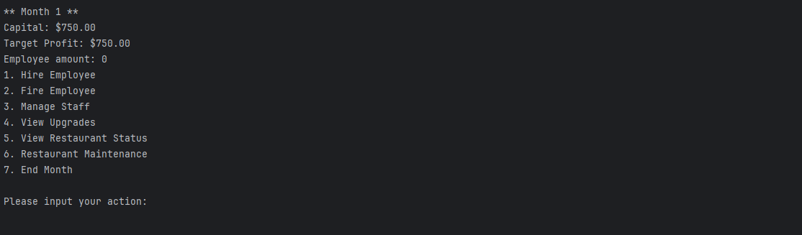

Made by: Marcellinus Ganesia Luviandanu_2702359572

# Object Oriented Programing Final Project

This is the final project repository for Object Oriented Programing class using Java Programming Languange. This project content is a restaurant simulation game that uses OOP concepts.

## Documentation

The project is documented in the form of a report and a poster.

- Report : https://docs.google.com/document/d/1tbVQBUeSGKLcSwFF9_TzC3T9A9UyRCI6QypuMMbdVwk/edit?usp=sharing
- Poster : https://drive.google.com/file/d/1jQ0AJjmiM4-TfDnjjehV2E0GgJJRKrl0/view?usp=drive_link

## Running The Program

To run the program, it could be done by downloading all the necesary file in this repository. Then it could be start by running the main program.

If all the code run smoothly then it should show this on you terminal :

